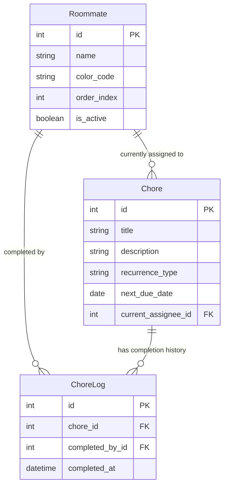

# Technical Architecture & Data Models: Flatmate Chore Manager

## 1. Technical Architecture & Stack

| Component | Technology | Rationale |
| :--- | :--- | :--- |
| **Backend** | Python 3 + Django | Built-in ORM, admin panel, robust routing, and form validation. |
| **Database** | SQLite | Zero-config, file-based, perfect for homework grading and demos. |
| **Frontend** | Django Templates + Tailwind/Bootstrap CSS | Server-rendered, no complex frontend build step required. |
| **State / Session** | Django Sessions | Remembers active roommate profile across pages. |

---

## 2. Data Models

