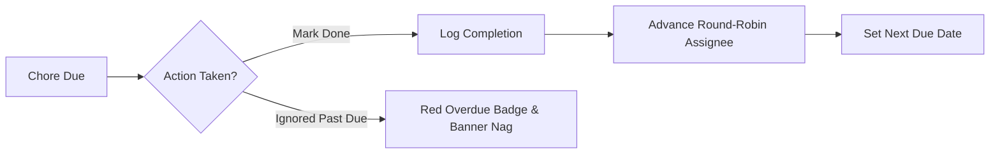
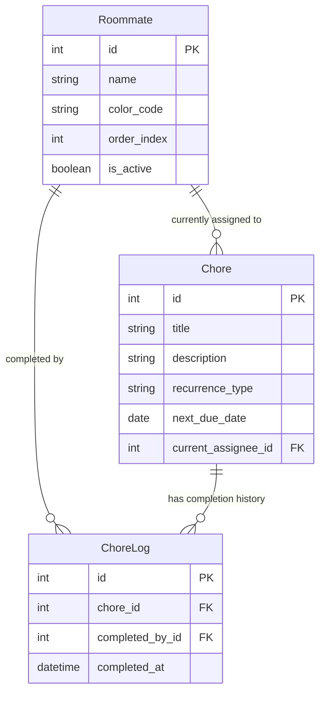

# Project Scope Specification: Flatmate Chore Manager

## 1. Project Overview & Goal
A lightweight, web-based household chore management tool designed for flatmates/roommates. It ensures fair division of labor through an automated **round-robin rotation** mechanism and maintains accountability with **in-app overdue badges and an activity feed**, without the friction of complex authentication.

---

## 2. Target Audience & Core Persona
- **Users**: Flatmates sharing an apartment or house.
- **Key Pain Point**: Confusion over whose turn it is and the social awkwardness of manually reminding/nagging flatmates.
- **Core Value**: Transparent, predictable rotation where everyone knows what they owe and when it is due.

---

## 3. Core Functional Requirements (MVP Scope)

### A. Roommate Profile Switcher
- Fast, low-friction profile switcher in the top navigation (stored in Django session).
- Roommates can switch identities with one click without passwords or login screens.
- Displays the currently selected roommate and their personal pending chores.

### B. Chore Management (CRUD)
- Create, view, edit, and archive chores.
- Attributes: Title, description, recurrence interval (Daily, Weekly, Bi-weekly, Monthly), initial assignee, due date.

### C. Automated Round-Robin Engine
- Roommates are arranged in a defined rotation queue for each chore.
- When a chore is marked **Done**:
  1. A completion record is written to the history log.
  2. The tool automatically advances the assignee to the next roommate in the queue.
  3. The due date automatically updates according to the recurrence interval.

### D. Accountability & Visual Nags (Honor System)
- **Honor System**: One-click completion button ("Mark as Done").
- **Visual Status Hierarchy**:
  - 🟢 **Upcoming**: Due in > 24 hours.
  - 🟡 **Due Today**: Due within 24 hours.
  - 🔴 **Overdue (Nag State)**: Past deadline; prominent badge and top-of-page warning banner.
- **Activity Log**: Chronological feed showing recent completions (e.g., *"Alex completed 'Take out trash' 2 hours ago"*).

---

## 4. Technical Architecture & Stack

| Component | Technology | Rationale |
| :--- | :--- | :--- |
| **Backend** | Python 3 + Django | Built-in ORM, admin panel, robust routing, and form validation. |
| **Database** | SQLite | Zero-config, file-based, perfect for homework grading and demos. |
| **Frontend** | Django Templates + Tailwind/Bootstrap CSS | Server-rendered, no complex frontend build step required. |
| **State / Session** | Django Sessions | Remembers active roommate profile across pages. |

---

## 5. Suggested Data Models

---

## 6. Explicitly Out of Scope (Guards Against Scope Creep)
To keep the homework deliverable and focused:
- ❌ **No Passwords / Auth / JWT**: Keeps setup frictionless.
- ❌ **No Photo Proof / Approval Gates**: Relies on flatmate trust.
- ❌ **No External Notifications**: No email SMTP configuration or SMS/Discord bot setup; all alerts are in-app.
- ❌ **No Financial Systems**: No rent splits, fines, or chore bidding.

---

## 7. Implementation Roadmap

1. **Phase 1: Project Setup & Models**
   - Initialize Django project and app.
   - Define `Roommate`, `Chore`, and `ChoreLog` models.
   - Seed default roommates and sample chores.
2. **Phase 2: Profile Switcher & Dashboard**
   - Implement session-based active roommate selector.
   - Build dashboard view listing "My Chores" and "All Household Chores".
3. **Phase 3: Completion & Round-Robin Logic**
   - Implement `mark_done` view/action.
   - Compute next roommate in sequence and calculate new `next_due_date`.
4. **Phase 4: Overdue Detection & Activity Feed**
   - Add template logic for visual overdue alerts and nag banners.
   - Render recent completion feed on dashboard.
